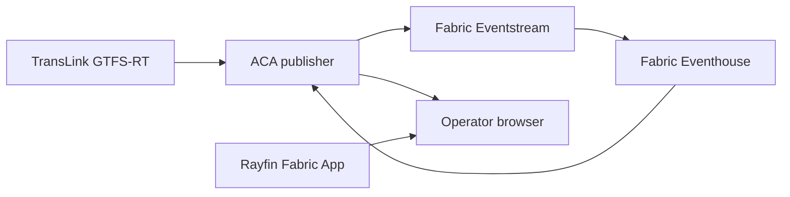

## Platform boundary

Fabric stores and analyzes telemetry after ingestion. Rayfin hosts the
authenticated application and operator-note database. One ACA publisher remains
outside Fabric to poll and decode TransLink's API-key-protected Protobuf feeds.



## Resource names

| Resource | Name |
| --- | --- |
| Fabric workspace | `TransLink Digital Twin` |
| Eventhouse | `TransLinkEventhouse` |
| KQL database | `TransLinkOperations` |
| Eventstream | `TransLinkTelemetry` |
| Lakehouse | `TransLinkSchedule` |
| Eventstream source | `TransLinkPublisher` |
| Azure resource group | `rg-translink-digital-twin` |
| Container App | `ca-translink-publisher` |
| ACA region | `westus2` |

Use a globally unique ACR name and immutable image tags.

## TransLink feeds

The publisher uses these official endpoints:

| Feed | Endpoint |
| --- | --- |
| Trips | `https://gtfsapi.translink.ca/v3/gtfsrealtime` |
| Positions | `https://gtfsapi.translink.ca/v3/gtfsposition` |
| Alerts | `https://gtfsapi.translink.ca/v3/gtfsalerts` |
| Static GTFS | `https://gtfs-static.translink.ca/gtfs/google_transit.zip` |

The realtime endpoints require an `apikey` query parameter. The publisher adds
it at request time and excludes the complete URL from errors so the key cannot
leak through logs or health responses.

## Azure isolation

Set `AZURE_CONFIG_DIR` before the first Azure CLI command. Verify the active
tenant and subscription immediately before every resource mutation.

```powershell
$env:AZURE_CONFIG_DIR = "$env:USERPROFILE\.azure-tenants\<alias>"
az account show --query "{tenant:tenantId, subscription:name}" --output table
```

Do not continue when either value differs from the approved profile.

## Fabric workspace

Create the workspace with the Fabric REST API or portal and assign the existing
capacity. The deployment script expects an existing workspace.

Deploy definitions:

```powershell
npx tsx scripts/deployFabric.ts `
  --tenant-id $TenantId `
  --subscription $SubscriptionId `
  --workspace-id $WorkspaceId
```

The script creates or reuses items by name. It applies the KQL schema, templates
notebook defaults, creates the schedule Lakehouse, and creates the Eventstream
custom endpoint. Fabric requires a changed Eventstream definition to be paused
before an update and resumed afterward; a fresh workspace does not need that
step.

Run `TransLinkScheduleBronze` once after deployment. It downloads the official
static archive and chains the silver and gold notebooks. Schedule it daily at
03:00 Pacific time with `Pacific Standard Time` as the Fabric scheduler time
zone.

The Fabric Lakehouse refresh does not update the static schedule bundled in the
ACA image. Before `data/gtfs-static/feed_info.txt` reaches its `feed_end_date`,
run `npm run gtfs:sync`, build a new immutable publisher image, and deploy a new
ACA revision. `/api/health` exposes `scheduleFeedEndDate` and `scheduleCurrent`;
`/api/ready` returns `503` when that schedule is missing or expired.

The `TransLinkNativeIngest` notebook is an ingestion prototype. It requires a
runtime parameter named `translink_api_key` and does not replace the ACA query
and snapshot API.

## Resolve Eventstream credentials

Read the `TransLinkPublisher` Custom Endpoint connection through the Fabric API.
Keep the brokers, topic, username, and password in memory. Store only the
password and TransLink API key as ACA secrets.

Required publisher settings:

```text
PORT=7071
TRANSLINK_GTFS_STATIC_DIR=/app/data/gtfs-static
TRANSLINK_POLL_INTERVAL_MS=15000
FABRIC_EVENTSTREAM_BROKERS=<broker>:9093
FABRIC_EVENTSTREAM_TOPIC=<topic>
FABRIC_EVENTSTREAM_USERNAME=$ConnectionString
FABRIC_EVENTSTREAM_PASSWORD=secretref:eventstream-password
FABRIC_KQL_QUERY_URI=<query-service-uri>
FABRIC_KQL_DATABASE=TransLinkOperations
PUBLISHER_ALLOWED_ORIGIN=https://deployment-pending.invalid
PUBLISHER_RATE_LIMIT_PER_MINUTE=60
```

Store the TransLink secret as:

```text
TRANSLINK_API_KEY=secretref:translink-api-key
```

## Create ACA resources

After asserting tenant and subscription, create the resource group, registry,
and Container Apps environment:

```powershell
az group create `
  --name rg-translink-digital-twin `
  --location westus2

az acr create `
  --resource-group rg-translink-digital-twin `
  --name <globally-unique-acr-name> `
  --sku Basic

az containerapp env create `
  --resource-group rg-translink-digital-twin `
  --name cae-translink-digital-twin `
  --location westus2
```

Build the image remotely:

```powershell
az acr build `
  --registry <acr-name> `
  --image "translink-digital-twin-publisher:<immutable-tag>" `
  --file Dockerfile.publisher `
  .
```

Create the Container App with a system identity, 0.5 CPU, 1 GiB memory, one
minimum replica, one maximum replica, external HTTPS ingress, and target port
`7071`. Grant that identity `AcrPull` on the registry before assigning the
private image.

Configure startup and liveness TCP probes on port `7071`. Configure readiness as
HTTP GET `/api/ready` on port `7071`. Readiness remains false until TransLink polling
and Eventstream publishing both succeed.

## Eventhouse access

Grant the publisher application identity viewer access to
`TransLinkOperations`. Set `FABRIC_KQL_QUERY_URI` and
`FABRIC_KQL_DATABASE=TransLinkOperations` before validating `/api/live`.

The application uses these KQL functions:

* `CurrentFleet()`
* `RoutePerformance()`
* `ActiveAlerts()`

## Rayfin deployment

Set the ACA HTTPS origin before running the canonical Rayfin deployment:

```powershell
$env:VITE_TELEMETRY_API_URL = 'https://<publisher-host>'
npx rayfin login --tenant $TenantId
npx rayfin up --workspace-id $WorkspaceId
npx rayfin up status --json
```

Read the deployed hosting URL from `rayfin/.deployments.json`. Change
`PUBLISHER_ALLOWED_ORIGIN` to that exact origin and create a new ACA revision.

Open the app through the Fabric portal. Direct browser navigation does not
provide the embedded Fabric SSO context.

## Validation

### Publisher

```powershell
Invoke-RestMethod 'https://<publisher-host>/api/health'
Invoke-RestMethod 'https://<publisher-host>/api/ready'
Invoke-RestMethod 'https://<publisher-host>/api/live'
Invoke-RestMethod 'https://<publisher-host>/api/route-performance?lookback=30m'
```

Expected behavior:

* Health reports recent poll and publish timestamps
* Health reports `scheduleCurrent: true`
* Readiness returns `200`
* Live data contains Metro Vancouver coordinates
* Invalid route lookbacks return `400`
* The TransLink API key never appears in responses or logs

### Fabric

Verify:

* All three Eventhouse destinations are `Running`
* `VehiclePositions`, `TripUpdates`, and `ServiceAlerts` receive current rows
* `CurrentFleet()` returns current vehicles
* Static schedule bronze, silver, and gold tables contain TransLink data

### Application

Verify desktop and mobile layouts, 2D and 3D maps, Rail/Ferry/Bus filters,
operator notes, embedded SSO, fallback simulation, and the required TransLink
data legend.

## Monitoring

Alert when:

* The last successful poll is older than one minute
* The last successful Eventstream publish is older than one minute
* `/api/live` fails for more than five minutes
* Eventstream destinations are not running
* Current Eventhouse observations are older than ten minutes
* The ACA replica restarts repeatedly

Never include the API key or Eventstream password in telemetry.

## Rotation

To rotate the TransLink key:

1. Register or retrieve the replacement through TransLink's developer portal.
2. Update the `translink-api-key` ACA secret without printing its value.
3. Restart or create a new ACA revision so the process receives the new secret.
4. Confirm `/api/ready` and a current Eventhouse observation.
5. Revoke the old key according to TransLink's portal process.

Eventstream credentials can rotate when the source is recreated or capacity is
resumed. Re-resolve the complete connection, update the ACA secret and settings,
then restart the revision.

## Rollback

Use immutable ACR tags. To roll back the publisher, point the Container App to a
previous validated image tag and verify readiness before shifting traffic.

For Fabric definitions, redeploy the previous Git commit. KQL schema changes in
this repository use non-destructive create-or-merge and create-or-alter
operations.

For Rayfin, check out the previous commit and run `npx rayfin up` against the
same workspace.

## Recovery

A new workspace rebuilds application structure but does not restore historical
Eventhouse rows or operator notes. Export those stores separately if disaster
recovery requires historical continuity.

If Fabric capacity is paused, the app, Eventhouse, Eventstream, and Rayfin
backend can become unavailable together. Resume capacity before rotating
credentials or diagnosing publisher connectivity.

## Data terms

Display this exact legend wherever TransLink route and arrival data is shown:

> Route and arrival data used in this product or service is provided by
> permission of TransLink. TransLink assumes no responsibility for the accuracy
> or currency of the Data used in this product or service.

Review TransLink's current developer terms before public or commercial use.
