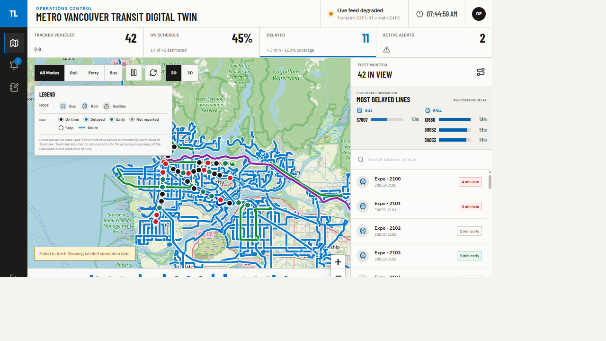
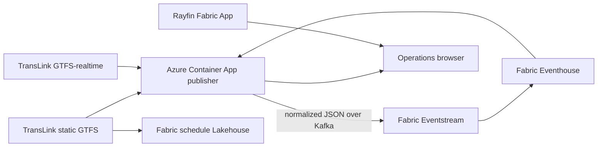

## Scope

The TransLink Digital Twin is a macro operations workspace for Metro Vancouver.
It combines TransLink GTFS and GTFS-realtime data with Microsoft Fabric
Real-Time Intelligence and a Rayfin Fabric App.



The application models routes, stops, trips, current vehicles, schedule
adherence, and service alerts. It includes buses, SkyTrain, West Coast Express,
and SeaBus based on the modes present in TransLink's static GTFS feed.

## Architecture



The realtime publisher stays in Azure Container Apps because TransLink exposes
three API-key-protected Protobuf feeds. Fabric Eventstream supplies the custom
endpoint used as the event broker, but it does not poll or decode the feeds.

## TransLink data contract

Realtime endpoints require a registered TransLink Open API key:

* Trip updates: `https://gtfsapi.translink.ca/v3/gtfsrealtime`
* Vehicle positions: `https://gtfsapi.translink.ca/v3/gtfsposition`
* Service alerts: `https://gtfsapi.translink.ca/v3/gtfsalerts`

The publisher appends the key as the `apikey` query parameter. It never logs the
key or includes the complete request URL in an error message.

Static GTFS is public:

* `https://gtfs-static.translink.ca/gtfs/google_transit.zip`

TransLink requires this legend when displaying its data:

> Route and arrival data used in this product or service is provided by
> permission of TransLink. TransLink assumes no responsibility for the accuracy
> or currency of the Data used in this product or service.

The application displays this legend in its map panel.

## Local validation

Install dependencies and build the TransLink network asset:

```powershell
npm ci
npm run gtfs:sync
npm test
npm run lint
npm run build
npm run typecheck:tools
npm run fabric:plan
```

Run the deterministic local demo without a TransLink API key:

```powershell
npx vite --mode demo --host=127.0.0.1 --port=5175
```

Open <http://127.0.0.1:5175>.

To run live data locally, set `TRANSLINK_API_KEY` in the publisher terminal
without placing its value in the repository, then run:

```powershell
npm run ingest
```

In a second terminal, point the demo UI at that publisher:

```powershell
$env:VITE_TELEMETRY_API_URL = 'http://127.0.0.1:7071'
npm run dev:demo
```

The live publisher listens on <http://127.0.0.1:7071>. The dashboard requests
`/api/live` first and falls back to `/api/snapshot` if Eventhouse is
unavailable.

The publisher image contains the static GTFS files generated by
`npm run gtfs:sync`. Its health response exposes `scheduleFeedEndDate` and
`scheduleCurrent`, and readiness fails when that bundled schedule expires.

## Deployment

The deployment uses:

* A new Fabric workspace assigned to an existing supported Fabric capacity
* `TransLinkEventhouse`, `TransLinkOperations`, and `TransLinkTelemetry`
* A `TransLinkSchedule` Lakehouse and static GTFS notebooks
* A Rayfin Fabric App for SSO, static hosting, and operator notes
* A new Azure resource group for ACR, the Container Apps environment, and the
  publisher

Start with [DEPLOYMENT-QUICKSTART.md](DEPLOYMENT-QUICKSTART.md). Operational and
recovery detail is in [DEPLOYMENT.md](DEPLOYMENT.md).

## Security boundaries

* The TransLink API key is a publisher secret and never enters browser code.
* Eventstream credentials remain in the publisher process or ACA secrets.
* The browser receives only public transit data, map tiles, and a Rayfin
  publishable key.
* Publisher endpoints contain public data but are unauthenticated. CORS and
  per-client throttling reduce casual misuse but are not authorization.
* Add Entra authentication or a governed API gateway before exposing internal
  operational, employee, passenger, or incident data.

## Repository layout

```text
fabric/        Fabric item definitions, notebooks, and KQL
 ingest/       TransLink GTFS-realtime decoder and publisher API
 rayfin/       Rayfin configuration and operator-note schema
 scripts/      GTFS generation and Fabric deployment tooling
 src/          React operations workspace
 public/data/  Generated TransLink network asset
```

## Official references

* [TransLink application developer resources](https://www.translink.ca/about-us/doing-business-with-translink/app-developer-resources)
* [TransLink GTFS-realtime](https://www.translink.ca/about-us/doing-business-with-translink/app-developer-resources/gtfs/gtfs-realtime)
* [TransLink static GTFS and terms](https://www.translink.ca/about-us/doing-business-with-translink/app-developer-resources/gtfs/gtfs-data)
* [GTFS-realtime specification](https://gtfs.org/documentation/realtime/reference/)
